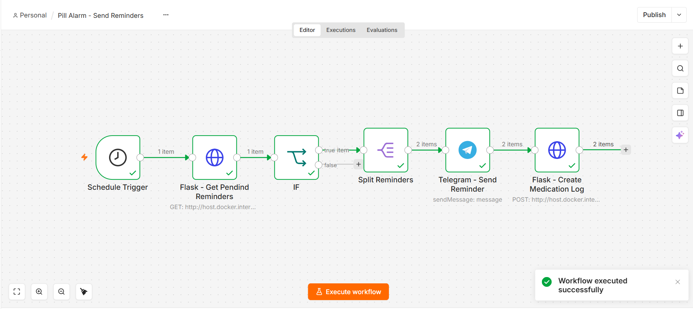
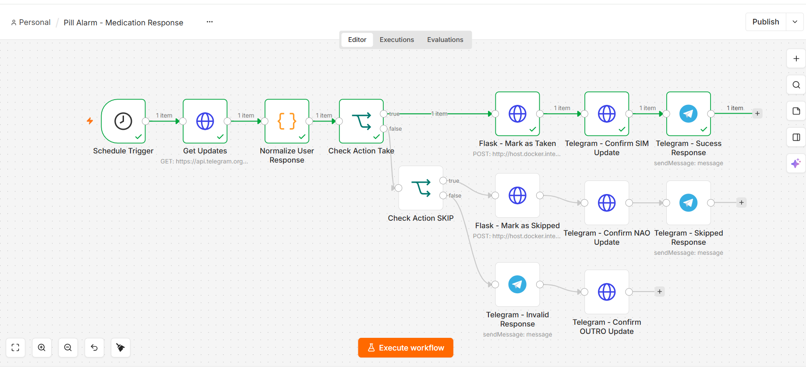

# Pill Alarm

O **Pill Alarm** é uma aplicação desenvolvida para auxiliar no controle de rotinas de medicação.

O sistema permite cadastrar usuários, medicamentos e horários programados, além de registrar o histórico das medicações como **tomadas** ou **não tomadas**.

A aplicação também utiliza automação para enviar lembretes pelo **Telegram** e processar a resposta do usuário.

---

## Sobre o projeto

O projeto foi desenvolvido com foco em integração entre **API, banco de dados, frontend e automação**, utilizando Flask como backend, PostgreSQL para persistência dos dados e n8n para orquestração dos lembretes e respostas.

A aplicação possui uma interface web para gerenciamento das medicações e uma integração com Telegram para envio e processamento dos lembretes.

O fluxo permite:

- Cadastro de usuários
- Cadastro de medicamentos
- Cadastro de horários de medicação
- Edição de medicamentos e horários
- Exclusão de medicamentos
- Visualização das medicações em um dashboard
- Geração automática de lembretes
- Envio de notificações pelo Telegram
- Registro da resposta do usuário
- Registro de medicações tomadas ou não tomadas
- Prevenção de registros duplicados

---

## Tecnologias

### Backend

- **Python**
- **Flask**
- **SQLAlchemy**
- **PostgreSQL**

### Frontend

- **HTML5**
- **CSS3**
- **JavaScript**
- **Fetch API**

### Automação e integração

- **n8n**
- **Telegram Bot API**
- **Docker**

---

<p align="center">




</p>

---

## Arquitetura

```mermaid
flowchart LR

    A[(PostgreSQL)] --> B[Flask API]

    B --> C[n8n<br/>Send Reminders]

    C --> D[Telegram]

    D --> E{Resposta}

    E -->|SIM| F[n8n<br/>Medication Response]

    E -->|NÃO| F

    F --> B

    B --> A